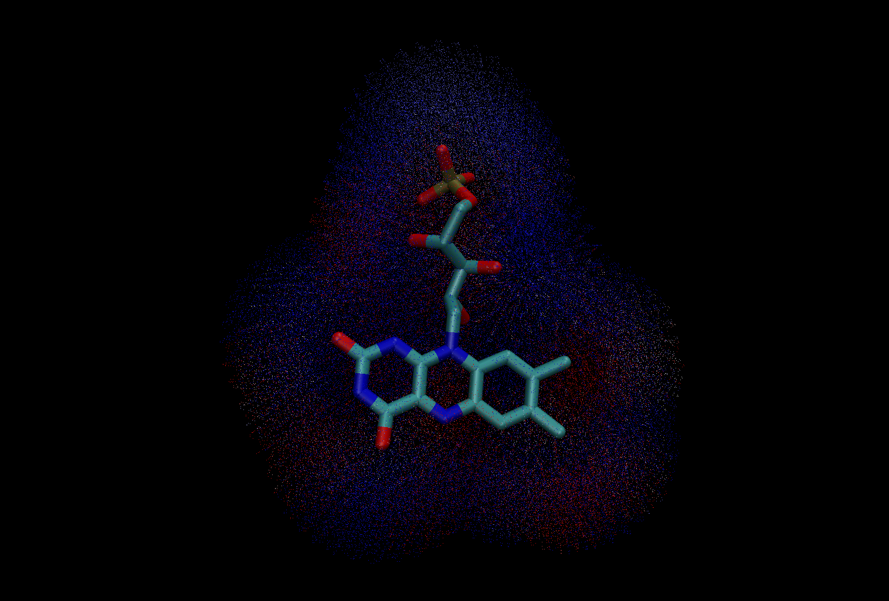

## PEPM - Protein Electrostatic Projection Map

<!-- {width=120 height=120} -->

Fig. 1: Projection of the Electrostatic Potential felt by FMN in *Avena sativa* Phototropin 1 LOV2 Domain (asLOV2)

This program describes the charges felt by a ligand from its apoenzyme.

I owe the accurate name to my PI, Dr. Samer Gozem.

## Dependencies
1. APBS
2. PDB2PQR
3. Open Babel
4. Scipy
5. Numpy
6. Matplotlib
   

## To run:
1. Clone the repository as you wish.
2. run main.sh
3. Type the PDB ID and wait a couple of minutes.

## To visualize:
1. cd into ${pdbID}_PEPM, this should contain mol2 files for the electrostatic projections and xyz files for the logands themselves. 
2. Open the corresponding mol2 file for each ligand and the ligand xyz file in your desired viewer.
3. Color the mol2 by charge.
4. Change the range as desired. I prefer +/- 5.

### Notes:
As always, there is the likelihood of codebreaks, therefore to make debugging easier:
1. I install dependencies per subprocess.
2. This program is intentionally modular.

I can't wait to see your results.
